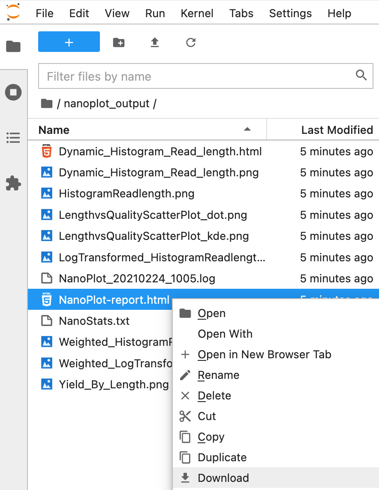

## Learning outcomes

**After having completed this chapter you will be able to:**

* Explain how the fastq format stores sequence and base quality information and why this is limited for long-read sequencing data
* Calculate base accuracy and probability based on base quality
* Describe how alignment information is stored in a sequence alignment (`.sam`) file
* Perform a quality control on long-read data with `NanoPlot`
* Perform a basic alignment of long reads with `minimap2`
* Visualise an alignment file in IGV on a local computer

## Material

[:fontawesome-solid-file-pdf: Download the presentation](../assets/pdf/QC_alignment.pdf){: .md-button }

## Exercises

### 1. Retrieve data

We will be working with data from:

> Clark, M. B. et al (2020). **Long-read sequencing reveals the complex splicing profile of the psychiatric risk gene CACNA1C in human brain**. Molecular Psychiatry, 25(1), 37–47. https://doi.org/10.1038/s41380-019-0583-1

The authors used full-transcript amplicon sequencing with Oxford Nanopore Technology of CACNA1C, a gene associated with psychiatric risk.

For the exercises of today, we will work with a single sample of this study. Download and unpack the data files in your home directory.

```sh
cd ~
wget https://ngs-longreads-training.s3.eu-central-1.amazonaws.com/ngs-longreads-training.tar.gz
tar -xvf ngs-longreads-training.tar.gz
rm ngs-longreads-training.tar.gz
```

**Exercise:** This will create the directory `data`. Check out what's in there.

??? done "Answer"
    Go to the `~/data` folder:

    ```sh
    cd ~/data
    ```

    The data folder contains the following:
    ```
    data/
    ├── reads
    │   └── cerebellum-5238-batch2.fastq.gz
    └── reference
        ├── Homo_sapiens.GRCh38.102.gtf
        ├── Homo_sapiens.GRCh38.dna.chromosome.12.fa
        └── Homo_sapiens.GRCh38.dna.chromosome.12.fa.fai

    2 directories, 4 files
    ```
    In the reads folder a fastq file with reads, in the reference folder, a gtf with annotations, the reference sequence and an index of the reference sequence.

### 2. Quality control

We will evaluate the read quality with `NanoPlot`.

**Exercise:** Check out the manual of `NanoPlot` with the command `NanoPlot --help`, and run `NanoPlot` on `~/data/reads/cerebellum-5238-batch2.fastq.gz`.

??? hint "Hint"
    For a basic output of `NanoPlot` on a `fastq.gz` file you can use the options `--outdir` and `--fastq`.

??? done "Answer"
    We have a `fastq` file, so based on the manual and the example we can run:

    ```sh
    cd ~
    NanoPlot \
    --fastq data/reads/cerebellum-5238-batch2.fastq.gz \
    --outdir nanoplot_output
    ```

You will now have a directory with the following files:

```
├── Dynamic_Histogram_Read_length.html
├── Dynamic_Histogram_Read_length.png
├── HistogramReadlength.png
├── LengthvsQualityScatterPlot_dot.png
├── LengthvsQualityScatterPlot_kde.png
├── LogTransformed_HistogramReadlength.png
├── NanoPlot_20210105_1339.log
├── NanoPlot-report.html
├── NanoStats.txt
├── Weighted_HistogramReadlength.png
├── Weighted_LogTransformed_HistogramReadlength.png
└── Yield_By_Length.png
```

The file `NanoPlot-report.html` contains a report with all the information stored in the other files.

**Exercise:** Download `NanoPlot-report.html` to your local computer and answer the following questions:

**A.** How many reads are in the file?

**B.** What is the average read length? Is there a wide distribution? Given that these sequences are generated from a long-range PCR, is that expected?

**C.** What is the average base quality and what kind of accuracy do we therefore expect?

!!! hint "Download files from the notebook"
    You can download files from the file browser, by right-clicking a file and selecting **Download**:

    <figure>
      
    </figure>

??? done "Answer"
    A. 3735

    B. The average read length is 6,003.3 base pairs. From the read length histogram we can see that there is a very narrow distribution. As a PCR will generate sequences of approximately the same length, this is expected.

    C. The average base quality is 7.3. We have learned that $p=10^{\frac{-baseQ}{10}}$, so the average probability that the base is wrong is $10^{\frac{-7.3}{10}} = 0.186$. The expected accuracy is $1-0.186=0.814$ or 81.4%.

### 3. Read alignment

The sequence aligner [`minimap2`](https://github.com/lh3/minimap2) is specifically developed for (splice-aware) alignment of long reads.

**Exercise:** Checkout the helper `minimap2 --help` and/or the [github readme](https://github.com/lh3/minimap2). We are working with reads generated from cDNA. Considering we are aligning to a reference genome (DNA), what would be the most logical parameter for our dataset to the option `-x`?

??? done "Answer"
    The option `-x` can take the following arguments:

    ```
    -x STR       preset (always applied before other options; see minimap2.1 for details) []
               - map-pb/map-ont: PacBio/Nanopore vs reference mapping
               - ava-pb/ava-ont: PacBio/Nanopore read overlap
               - asm5/asm10/asm20: asm-to-ref mapping, for ~0.1/1/5% sequence divergence
               - splice: long-read spliced alignment
               - sr: genomic short-read mapping
    ```
    We are working with ONT data so we could choose `map-ont`. However, our data is also spliced. Therefore, we should choose `splice`.

Introns can be quite long in mammals; up to a few hundred kb.

**Exercise:** Look up the CACNA1C gene in hg38 in IGV, and roughly estimate the length of the longest intron.

!!! hint "Hint"
    First load hg38 in IGV, by clicking the topleft drop-down menu:

    <figure>
      
    </figure>

    After that type `CACNA1C` in the search box:

    <figure>
      
    </figure>

??? done "Answer"
    The longest intron is about 350 kilo bases (350,000 base pairs)

**Exercise:** Check out the `-G` option of `minimap2`. How does this relate to the the largest intron size of CACNA1C?

??? done "Answer"
    This is what the manual says:

    ```
    -G NUM       max intron length (effective with -xsplice; changing -r) [200k]
    ```

    We found an intron size of approximately 350k, so the default is set too small. We should be increase it to at least 350k.

**Exercise:** Make a directory called `alignments` in your working directory. After that, modify the command below for `minimap2` and run it from a script.

```sh
#!/usr/bin/env bash

cd ~

minimap2 \
-a \
-x [PARAMETER] \
-G [PARAMETER] \
-t 2 \
data/references/GRCh38.p13.chr12.fa \
data/reads/cerebellum-5238-batch2.fastq.gz \
| samtools sort \
| samtools view -bh > alignments/cerebellum-5238-batch2.bam

## indexing for IGV
samtools index alignments/cerebellum-5238-batch2.bam
```

??? done "Answer"
    Make a directory like this:

    ```sh
    mkdir ~/workdir/alignments
    ```

    Modify the script to set the `-x` and `-G` options:

    ```sh
    #!/usr/bin/env bash

    cd ~

    minimap2 \
    -a \
    -x splice \
    -G 500k \
    -t 2 \
    data/reference/Homo_sapiens.GRCh38.dna.chromosome.12.fa \
    data/reads/cerebellum-5238-batch2.fastq.gz \
    | samtools sort \
    | samtools view -bh > alignments/cerebellum-5238-batch2.bam

    ## indexing for IGV
    samtools index alignments/cerebellum-5238-batch2.bam
    ```

    And run it (e.g. if you named the script `ont_alignment.sh`):

    ```sh
    chmod u+x ont_alignment.sh
    ./ont_alignment.sh
    ```

### 4. Visualisation

Let's have a look at the alignments. Download the files `cerebellum-5238-batch2.bam` and `cerebellum-5238-batch2.bam.bai` to your local computer and load the `.bam` file into IGV (**File > Load from File...**).

**Exercise:** Have a look at the region `chr12:2,632,655-2,635,447` by typing it into the search box. Do you see any evidence for alternative splicing already?

??? done "Answer"
    The two exons seem to be mutually exclusive:

    <figure>
      
    </figure>
