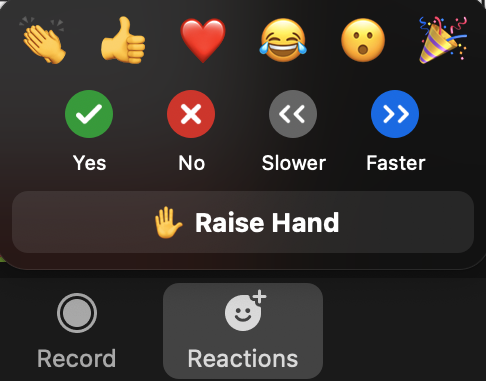

## Teacher

- Joana Carlevaro Fita [:custom-orcid:](https://orcid.org/0000-0002-1674-2055)

## Helper

- Alexander Nater [:custom-orcid:](https://orcid.org/0000-0002-4805-5575)

## Authors

- Geert van Geest [:custom-orcid:](https://orcid.org/0000-0002-1561-078X)
- Marco Kreuzer [:custom-orcid:](https://orcid.org/0000-0001-6784-0854)
- Patricia Palagi [:custom-orcid:](https://orcid.org/0000-0001-9062-6303)

## Learning outcomes

### General learning outcomes

After this course, you will be able to:

* Describe the basics behind PacBio SMRT sequencing and Oxford Nanopore Technology sequencing
* Use the command line to perform quality control and read alignment of long-read sequencing data
* Develop and execute a bioinformatics pipeline to perform an alignment-based analysis
* Answer biological questions based on the analysis resulting from the pipeline

### Learning outcomes explained

To reach the general learning outcomes above, we have set a number of smaller learning outcomes. Each chapter (found at [Course material](course_material/introduction.md)) starts with these smaller learning outcomes. Use these at the start of a chapter to get an idea what you will learn. Use them also at the end of a chapter to evaluate whether you have learned what you were expected to learn.

## Learning experiences

To reach the learning outcomes we will use lectures, exercises, polls and group work. During exercises, you are free to discuss with other participants. During lectures, focus on the lecture only.

### Exercises

Each block has practical work involved. Some more than others. The practicals are subdivided into chapters, and we'll have a (short) discussion after each chapter. All answers to the practicals are incorporated, but they are hidden. Do the exercise first by yourself, before checking out the answer. If your answer is different from the answer in the practicals, try to figure out why they are different.

### Asking questions
During lectures, you are encouraged to raise your hand if you have questions (if in-person), or use the Zoom functionality (if online). Find the buttons in the participants list ('Participants' button):

<figure>
  
</figure>

Alternatively, (depending on your zoom version or OS) use the 'Reactions' button:

<figure>
  
</figure>

**To summarise:**

* During lectures: raise hand/zoom functionality
* Personal interest questions: **#background**
* During exercises: **\#q-and-a** on slack
